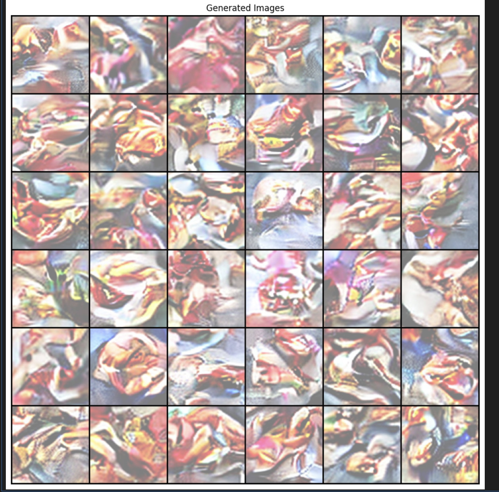
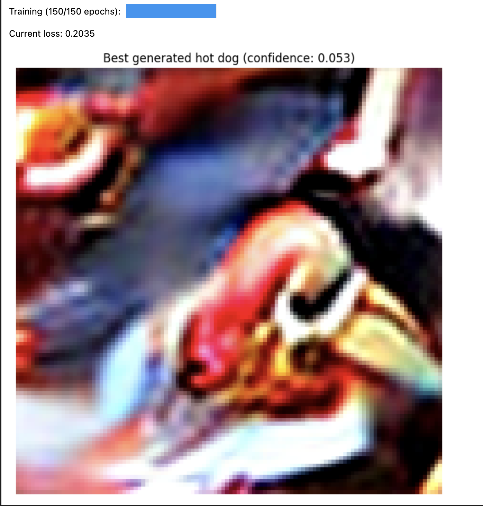

# 🌭 Hot-Dog Generator using Latent Diffusion

This project implements a simplified **Latent Diffusion Model (LDM)** to generate images of hot dogs, inspired by the famous “hot dog / not hot dog” episode from the TV show *Silicon Valley*. It was completed as part of the **Deep Learning** course at **Imperial College London**.

### Example Outputs:
The following results were generated using the trained latent diffusion model:

  
  

---

## Project Overview

The notebook includes two main components:

1. **Variational Autoencoder (VAE)**
   - Learn or load latent representations for images
   - Due to compute limits, pretrained encoders from Stable Diffusion are used

2. **Denoising Diffusion Probabilistic Model (DDPM)**
   - Train a latent-space diffusion model to generate hot-dog images from noise
   - Evaluate generated samples using a pretrained hot-dog detector

---

## Tasks Completed

This project includes the following major components and tasks:

### VAE Phase
- **Defining and Designing the VAE**  
  Implemented a custom encoder-decoder VAE architecture tailored for compact latent representation of images.

- **Training and Experimenting with Different Betas**  
  Explored different values of the β hyperparameter in the VAE loss function to balance reconstruction quality and latent regularization (KL divergence).

- **Image Reconstruction & Sampling**  
  Trained the VAE to reconstruct input images and generated samples from latent vectors to evaluate generation quality.

- **Latent Space Interpolation**  
  Performed linear interpolation in the latent space \(z\) to visualize transitions between image pairs and assess latent continuity.

- **T-SNE Visualization**  
  Applied T-SNE to VAE latent codes to examine clustering behavior and the semantic structure of the learned representations.

### DDPM Phase
- **Training a DDPM in Latent Space**  
  Trained a denoising diffusion probabilistic model on top of VAE-compressed latent representations to reduce computational complexity while learning to generate plausible images.

- **Sampling and Image Generation**  
  Sampled from the trained DDPM to produce new latent vectors, then decoded them into full-resolution hot-dog-like images using the VAE decoder.

- **Qualitative Evaluation with Hot-Dog Detector**  
  Used a pretrained classifier to assess how realistically the generated images resemble hot dogs.

---

## Main Libraries Used

- PyTorch
- Torchvision
- Stable Diffusion (for pretrained encoder-decoder)
- PIL, Matplotlib, TQDM
- torchvision.transforms

---

## License

For educational purposes only — part of the Deep Learning course at Imperial College London.
